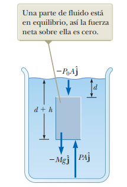
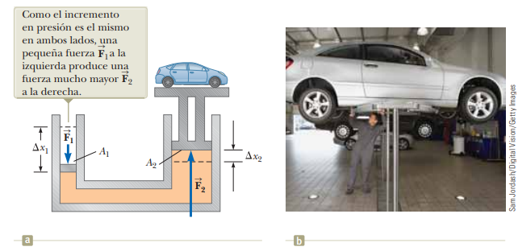

# 14.2 - Variación de la presión con la profundidad

### Resumen:

Si se toma una columna de fluido en equilibrio, se tiene que esta columna es presionada desde todas las direcciones. Las presiones horizontales se anulan entre sí. Sin embargo, la presión vertical varía con la profundidad.

Si la columna de fluido no se está moviendo, hay un equilibrio entre la fuerza que ejerce el fluido encima de la columna, la que ejerce el fluido por debajo de la columna y el propio peso de la columna. Podemos partir de la segunda ley de Newton y representar el peso de la columna del agua en términos de densidad y volumen.

$\vec{F}$: Fuerza que actúa sobre la parte inferior de la columna de fluido  
$\vec{F}_0$: Fuerza que actúa sobre la parte superior de la columna de fluido  
$\vec{F}_g$: peso de la columna de fluido  
$\rho$: Densidad del fluido  
$V$: Volumen de la columna de fluido  
$g$: Aceleración gravitacional  

$$ \sum{\vec{F}} = \vec{0} $$

$$ \vec{F} + \vec{F}_0 + \vec{F}_g = \vec{0} $$

Todos los vectores de fuerza son verticales. Podemos tomar el sentido hacia arriba como positivo:

$$ F - F_0 - F_g = 0 $$

$$ F - F_0 - mg = 0 $$

$$ F - F_0 - \rho Vg = 0 $$

Ahora, las fuerzas que empujan el fluido las podemos representar en términos de presión y área. El volumen de la columna de agua también lo podemos representar en términos de área y de altura de la columna. Así, podemos cancelar las áreas en la ecuación.

$P$: Presión sobre la parte inferior de una columna de fluido  
$P_0$: Presión sobre la parte superior de una columna de fluido  
$A$: Área transversal de la columna de fluido  
$h$: Altura de la columna de fluido  

$$ F - F_0 - \rho Vg = 0 $$

$$ PA - P_0 A - \rho Ahg = 0 $$

$$ P - P_0 - \rho gh = 0 $$

Tenemos entonces que la presión sobre una columna de fluido está dada por:

$$ P = P_0 + \rho gh \space_{[14.4]}$$

La **ley de Pascal** indica que una presión aplicada sobre un fluido se transmite sin disminución sobre todo el fluido, incluido donde se encuentra con las paredes del recipiente. Debido a esto, una fuerza menor en una superficie menor ocasiona una fuerza mayor en una superficie mayor.

### Notas:

La ecuación `14.4` se puede intuir mejor en términos de variación de la presión entre diferentes profundidades. Así, $h$ es la diferencia entre las profundidades comparadas:

$$ P = P_0 + \rho gh$$

$$ P - P_0 = \rho gh$$

$$ \Delta P = \rho gh$$

La ley de Pascal está indicando que la presión por unidad de área es constante. Luego, una fuerza menor en un área menor conlleva una fuerza mayor en un área mayor. Por conservación de la energía, esto implica también que un pistón con mayor área se va a desplazar menos que uno con menor área.