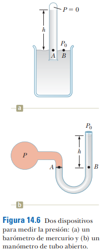

# 14.3 - Mediciones de presión

### Resumen:

Un **barómetro** de mercurio (a) se basa en que la presión que una columna de mercurio ejerce sobre un fluido es igual a la que ejerce la atmósfera. En una altitud diferente, este equilibrio también cambia, de modo que la altura de la columna de mercurio varía. La parte superior del tubo está en vacío, de modo que su presión es 0. Midiendo esta variación se puede estimar la variación de la presión respecto a un punto de referencia (como el nivel del mar).

Un **manómetro** (b) mide la presión de un gas contenido en el fondo. Al estar en equilibrio, y conociendo la presión atmosférica ($P_0$), es posible determinar cuál es la presión del gas ($P$).

### Notas:

Recordar la ecuación `14.4`:

$$ P = P_0 + \rho gh $$

Para el caso del barómetro, tenemos:

$$ 0 = P_0 + \rho gh $$

$$ P_0 = - \rho gh $$

Aparentemente, el resultado es una presión negativa, pero en realidad, la ecuación `14.4` se definió con $P_0$ arriba (donde hay menos presión) y $P$ abajo (donde hay más presión). Dado que esta convención se invirtió la posición en la figura `14.6`, también hay que poner negativa `h`. Por lo tanto, la presión atmosférica quedaría así:

$$ P_0 = \rho gh $$

Para el caso del manómetro, simplemente utilizamos la ecuación `14.4` para calcular $P$, conociendo la presión atmosférica ($P_0$) y la altura de la columna ($h$).