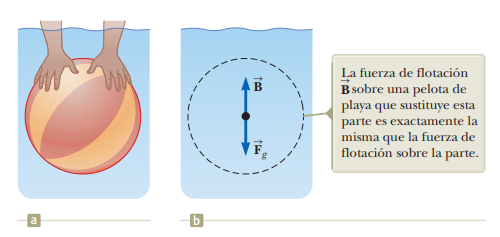
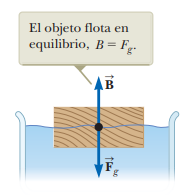

# 14.4 - Fuerzas de flotación y principio de Arquímedes

### Resumen:

Si se estudia una parte de un volumen de fluido en reposo (b), debe haber una fuerza que la empuja hacia arriba para contrarrestar el peso del volumen. Ahora, si se reemplaza este volumen de fluido por un objeto (a), la fuerza que va hacia arriba se mantiene constante, pero el peso cambia por el del objeto. La fuerza que va hacia arriba se denomina **fuerza de flotación**. Si el objeto es más liviano que el volumen equivalente de fluido, entonces la fuerza neta va hacia arriba. Si es más pesado, va hacia abajo.

Se conoce como el **principio de Arquímedes** a la proposición según la cual la fuerza de flotación equivale al peso del volumen de fluido desplazado.

$F_b$: Fuerza de flotación  
$F_{gf}$: Peso del fluido  
$m_f$: Masa del fluido desplazado por el objeto  
$V_f$: Volumen del fluido desplazado por el objeto  
$\rho_f$: Densidad del fluido  
$g$: Aceleración gravitacional  

$$ F_b = F_{gf} $$

$$ F_b = m_f g $$

$$ F_b = \rho_f V_f g \space_{[14.5]} $$

Cuando un objeto flota en la superficie, una parte del objeto está por fuera del fluido y el resto está dentro del fluido. Nuevamente, el volumen desplazado de fluido equivale a la fuerza de flotación. Entre más liviano sea el objeto, menos volumen desplaza y menos se hunde.

Tomando la ecuación `14.5` y partiendo de que el objeto está flotando en la superficie, tenemos:

$F_g$: Peso del objeto  
$m$: Masa del objeto  
$V$: Volumen del objeto  
$\rho$: Densidad del objeto  

$$ \sum F = 0 $$

$$ F_b - F_g = 0$$

$$ F_b = F_g$$

$$ \rho_f V_f g = \rho Vg $$

$$ \rho_f V_f = \rho V $$

$$ \frac{V_f}{V} = \frac{\rho}{\rho_f} \space_{[14.6]} $$

### Notas:

Como se vio previamente en la sección `14.2`, una columna de fluido arbitraria es presionada desde todas las direcciones. La fuerza de flotación viene siendo la fuerza neta que ejerce el fluido sobre el objeto. Dado que las fuerzas laterales se anulan entre sí, la fuerza de flotación equivale a la diferencia entre la fuerza que ejerce el fluido abajo y desde arriba.

$F$: Fuerza que actúa sobre la parte inferior de la columna de fluido  
$F_0$: Fuerza que actúa sobre la parte superior de la columna de fluido  
$F_g$: Peso de la columna de fluido  
$F_b$: Fuerza de flotación sobre el objeto  

$$ \sum{F} = (F - F_0) - F_g $$

$$ \sum{F} = F_b - F_g $$

La ecuación `14.6` muestra que la razón entre volúmenes coincide con el recíproco de la razón entre densidades, ambos números adimensionales. Sin embargo, es más fácil aprenderse la ecuación de en términos de masa desplazada:

$$ \rho_f V_f = \rho V $$

$$ m_f = m $$