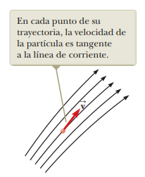
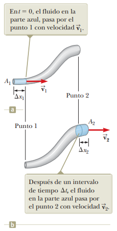

# 14.5 - Dinámica de fluidos

### Resumen:

El flujo de un fluido se clasifica en:

- **Flujo estable** o **flujo laminar**: cuando cada partícula del fluido sigue una trayectoria que no se cruza con las demás.
- **Flujo turbulento**: cuando las trayectorias de las partículas se cruzan y arremolinan.

Un flujo se considera de **fluido ideal** cuando cumple con las siguientes características:
- Es laminar
- No es viscoso: no hay fricción entre las partículas
- Es incompresible: su densidad es constante, independientemente de la presión
- Es irrotacional: su momento angular respecto a cualquier punto es nulo

En un flujo estable, se denominan **líneas de corriente** a las trayectorias que describen las partículas que conforman el fluido. El conjunto de las líneas de corriente se denomina **tubo de flujo**.

Un fluido ideal es incompresible. Dado que su densidad no puede cambiar, cuando un tubo se ensancha o angosta, debe moverse la misma cantidad de fluido en el mismo tiempo.

Tenemos entonces para dos porciones del tubo con distintos calibres lo siguiente:

$m$: Masa del fluido en la sección 1 o 2  
$V$: Volumen del fluido en la sección 1 o 2  
$\rho$: Densidad del fluido  
$t_1$: Tiempo que le toma al fluido pasar por la sección 1  
$t_2$: Tiempo que le toma al fluido pasar por la sección 2  
$A_1$: Área transversal de la sección 1  
$A_2$: Área transversal de la sección 2  
$\Delta x_1$: Longitud de la sección 1  
$\Delta x_2$: Longitud de la sección 2  
$v_1$: Velocidad del fluido en la sección 1  
$v_2$: Velocidad del fluido en la sección 2  

$$ \frac{m}{t_1} = \frac{m}{t_2} $$

Sabemos que la masa y el volumen se relacionan entre sí a través de la densidad:

$$ \frac{\rho V}{t_1} = \frac{\rho V}{t_2} $$

$$ \frac{V}{t_1} = \frac{V}{t_2} $$

Además, el volumen se puede calcular multiplicando el área transversal de la sección de flujo por su longitud:

$$ \frac{A_1 \Delta x_1}{t_1} = \frac{A_2 \Delta x_2}{t_2} $$

$$ A_1 v_1 = A_2 v_2 \space_{[14.7]} $$

Encontramos entonces que la velocidad del fluido aumenta cuando el area transversal disminuye y viceversa. Esta ecuación se conoce como la **ecuación de continuidad de fluidos**.