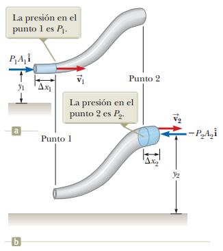

# 14.6 - Ecuación de Bernoulli

### Resumen:

El trabajo ejercido sobre una porción de fluido que se desplaza entre dos puntos en un tubo de flujo, está dado por la siguiente ecuación:

$W$: Trabajo  
$V$: Volumen de la porción de fluido  
$P_1$: Presión sobre la porción de fluido en el punto inicial  
$P_2$: Presión sobre la porción de fluido en el punto final  

$$ W = (P_2 - P_1) V \space_{[14.8]}$$

Además, tenemos que el trabajo conlleva un cambio en la energía mecánica. En este caso, la energía mecánica es la suma de la energía cinética y potencial gravitatoria:

$\Delta K$: Variación en la energía cinética de la porción de fluido.  
$\Delta U_g$: Variación en la energía potencial gravitatoria de la porción de fluido.  

$$ W = \Delta K + \Delta U_g $$

Si remplazamos aquí la ecuación `14.8` y expandimos la energía cinética y potencial tenemos:

$$ (P_2 - P_1) V = K_2 - K_1 + U_{g2} - U_{g1} $$

$$ (P_2 - P_1) V = \frac{1}{2} m v_2^2 - \frac{1}{2} m v_1^2 + mg h_2 - mg h_1 $$

$$ P_2 - P_1 = \frac{1}{2} \frac{m v_2^2}{V} - \frac{1}{2} \frac{m v_1^2}{V} + \frac{mg h_2}{V} - \frac{mg h_1}{V} $$

Dado que la densidad es la masa por unidad de volumen, tenemos entonces:

$$ P_2 - P_1 = \frac{1}{2} \rho v_2^2 - \frac{1}{2} \rho v_1^2 + \rho g h_2 - \rho g h_1 $$

$$ P_1 - \frac{1}{2} \rho v_1^2 - \rho g h_1 = P_2 - \frac{1}{2} \rho v_2^2 - \rho g h_2 \space_{[14.12]}$$

La ecuación `14.12` se conoce como la **ecuación de Bernoulli** y nos indica qué se mantiene constante en puntos distintos de un mismo tubo de flujo, para un fluido incompresible. Aquí podemos ver que la presión disminuye cuando aumenta la altura.

### Notas:

La ecuación `14.8` se puede deducir así:

$$ W = \int_{\vec{r_1}}^{\vec{r_2}}{\vec{F} \cdot \mathrm{d} \vec{r}} $$

Los vectores fuerza y diferencial de desplazamiento apuntan en las mismas direcciones. Luego:

$$ W = \int_{r_1}^{r_2}{F \mathrm{d}r} $$

$$ W = F_2 r_2 - F_1 r_1 $$

$$ W = P_2 A_2 r_2 - P_1 A_1 r_1 $$

Dado que el fluido es incompresible, el volumen en cuestión de la porción analizada no cambia. Luego:

$$ W = P_2 V - P_1 V $$

$$ W = (P_2 - P_1) V $$