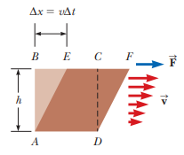

# 14.7 - Flujo de fluidos viscosos en tuberías

### Resumen:

Un flujo ideal no es viscoso, de modo que no hay una resistencia al movimiento de las partículas del fluido. Por esta razón, cuando un tubo es horizontal y tiene una sección de área constante, la presión también es constante. En la práctica, los fluidos suelen tener viscosidad. Debido a esto, suele haber una caída de presión entre dos puntos que se puede representar mediante la siguiente ecuación:

$\Delta P$: Diferencia de presión entre dos puntos.  
$I_V$: Caudal volumétrico del flujo, en unidades de volumen sobre tiempo.  
$R$: Resistencia del fluido al flujo.  

$$ \Delta P = I_V R \space_{[14.14]}$$

Cuando una capa de fluido se desplaza paralela a una superficie, la viscosidad hace que se pegue a dicha superficie. Las partes de la capa más cercanas a la superficie avanzan menos y las más lejanas avanzan más.

Aquí podemos establecer una relación de proporcionalidad entre la fuerza que mueve al fluido y la velocidad a la que avanza para un espesor dado ($h$) y una área transversal dada ($A$). Tenemos entonces:

$A$: Área de la lámina del fluido evaluada  
$F$: Fuerza que empuja la lámina del fluido tangencialmente  
$v$: Velocidad a la que se desplaza la lámina de fluido  
$h$: Distancia que separa la lámina de fluido dela superficie  
$\eta$: Constante de viscosidad, en unidades de presión multiplicado por tiempo.  

$$ F = \eta A \frac{v}{h} \space_{[14.18]}$$

En una tubería cilíndrica, la resistencia del fluido en un segmento de longitud $L$ y radio $r$ está dada por:

$$ R = \frac{8 \eta L}{\pi r^4} \space_{[14.19]} $$