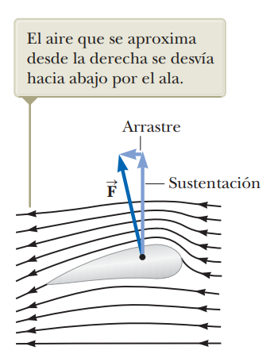

# 14.8 - Otras aplicaciones de la dinámica de fluidos

### Resumen:

Cuando un avión avanza, se genera una fuerza hacia arriba llamada **sustentación** que lo eleva. Parte de la sustentación se debe a que la forma del ala comprime el aire arriba de ella.

Dado que el aire va más rápido, la presión es menor que en la parte de abajo, de acuerdo con la ecuación de Bernoulli. Luego, la presión en la parte de abajo empuja el ala hacia arriba.