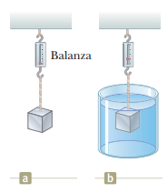

### Enunciado:

La fuerza gravitacional que se ejerce sobre un objeto sólido es $5.00 \mathrm{N}$. Cuando el objeto se suspende de una balanza de resorte y se sumerge en agua, la lectura en la balanza es $3.50 \mathrm{N}$ (figura `P14.26`). Encuentre la densidad del objeto.

### Solución

Claramente se equivocaron en la figura. Se refieren a la `P14.11`. Podemos partir de la segunda ley de Newton para encontrar la densidad, partiendo de que la aceleración es nula:

$\sum{\vec{F}}$: Fuerza neta sobre el objeto  

$$ \sum{\vec{F}} = \vec{0} $$

Si tomamos el sentido hacia arriba como positivo, tenemos:

$\vec{F}_b$: Fuerza de flotación sobre el objeto  
$\vec{F}_t$: Fuerza de tensión del dinamómetro  
$\vec{F}_g$: Peso del objeto  

$$ \sum{F} = 0 $$

$$ F_b + F_t - F_g = 0 $$

$$ F_b + F_t - F_g = 0 $$

$$ F_b = F_g - F_t $$

Podemos utilizar la ecuación `14.5` para expandir la fuerza de flotación:

$\rho_a$: Densidad del agua  
$V_a$: Volumen desplazado del agua  
$g$: Aceleración de la gravedad  

$$ \rho_a V_a g = F_g - F_t $$

$$ V_a = \frac{F_g - F_t}{\rho_a g} $$

El volumen desplazado de agua es equivalente al volumen del objeto, el cual a su vez podemos describir en términos de su masa y su densidad. Tenemos entonces:

$V$: Volumen del objeto  
$m$: Masa del objeto  
$\rho$: Densidad del objeto  

$$ V = \frac{F_g - F_t}{\rho_a g} $$

$$ \frac{m}{\rho} = \frac{F_g - F_t}{\rho_a g} $$

$$ \rho = \frac{\rho_a mg}{F_g - F_t} $$

El producto de la masa del objeto y la aceleración de la gravedad es el peso. Tenemos entonces:

$$ \rho = \frac{\rho_a F_g}{F_g - F_t} $$

$$ \rho = \frac{F_g}{F_g - F_t} \rho_a $$

Remplazamos y obtenemos:

$F_g = 5.00 \mathrm{N}$  
$F_t = 3.50 \mathrm{N}$  
$\rho_a = 1000 \frac{\mathrm{kg}}{\mathrm{m}^3}$  

$$ \rho = \frac{5.00 \mathrm{N}}{5.00 \mathrm{N} - 3.50 \mathrm{N}} \times 1000 \frac{\mathrm{kg}}{\mathrm{m}^3} $$

$$ \rho = 3.33 \times 10^3 \frac{\mathrm{kg}}{\mathrm{m}^3} $$