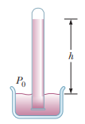

### Enunciado:

Blaise Pascal duplicó el barómetro de Torricelli usando un vino tinto Bordeaux, de $984 \frac{\mathrm{kg}}{\mathrm{m}^3}$ de densidad, como el líquido de trabajo (figura `P14.9`). (a) ¿Cuál fue la altura $h$ de vino para presión atmosférica normal? (b) ¿Esperaría que el vacío sobre la columna sea tan bueno como para el mercurio?

### Solución

La presión aplicada sobre el líquido es solo la presión atmosférica, pues el tubo está vacío en la parte superior. Para la parte (a), podemos partir de la ecuación `14.4`, teniendo que la presión en la parte superior del tubo es nula:

$P_0$: Presión en la parte superior del tubo (nula)  
$P$: Presión atmosférica  
$\rho$: Densidad del agua  
$g$: Aceleración gravitacional  
$h$: Altura de la columna de vino 

$$ P = P_0 + \rho gh $$

$$ P = \rho gh $$

$$ h = \frac{P}{\rho g} $$

Remplazando, tenemos:

$P = 1.013 \times 10^5 \mathrm{Pa}$  
$g = 9.80 \cfrac{\mathrm{m}}{\mathrm{s}^2}$  
$\rho = 984 \cfrac{\mathrm{kg}}{\mathrm{m}^3}$  

$$ h = \frac{1.013 \times 10^5 \mathrm{Pa}}{\left( 984 \cfrac{\mathrm{kg}}{\mathrm{m}^3} \right) \left( 9.80 \cfrac{\mathrm{m}}{\mathrm{s}^2} \right)} $$

$$ h = 10.5 \mathrm{m} $$

La columna de vino tiene tan baja densidad que asciende muchos metros.

Para comparar el comportamiento del mercurio (b), remplazamos la densidad del vino por la del mercurio:

$\rho_{Hg} = 13.6 \times 10^3 \cfrac{\mathrm{kg}}{\mathrm{m}^3}$  

$$ h = \frac{1.013 \times 10^5 \mathrm{Pa}}{\left( 13.6 \times 10^3 \cfrac{\mathrm{kg}}{\mathrm{m}^3} \right) \left( 9.80 \cfrac{\mathrm{m}}{\mathrm{s}^2} \right)} $$

$$ h = 0.760 \mathrm{m} $$

En el caso del mercurio, la columna se eleve menos de un metro. Se puede concluir que el mercurio es mejor para medir variaciones fuertes de presión, mientras que el vino es mejor para medir variaciones muy suaves de presión.