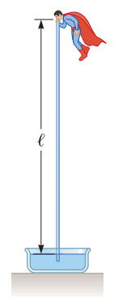

### Enunciado:

*¿Por qué es imposible la siguiente situación?* La figura P14.4 muestra a Superman intentando beber agua fría con un popote de longitud $l = 12.0 \mathrm{m}$. Las paredes del popote tubular son muy fuertes y no colapsan. Con su gran fuerza, logra la máxima succión posible y disfruta beber el agua fría.

### Solución

Podemos partir de la ecuación `14.4` para calcular la presión a la altura de Superman:

$$ P = P_0 + \rho gl $$

$$ P_0 = P - \rho gl $$

Tenemos que a nivel del mar, la presión es de $101325 \mathrm{Pa}$. La densidad del agua es por definición $1000 \mathrm{kg} / \mathrm{m}^3$ Entonces, al remplazar tenemos:

$$ P_0 = (101325 \mathrm{Pa}) - (1000 \mathrm{kg} / \mathrm{m}^3) (9.8 \mathrm{m}/\mathrm{s}^2)(12 \mathrm{m}) $$

$$ P_0 = -16270 \mathrm{Pa} $$

El resultado es una presión negativa, lo cual es imposible. Esto quiere decir que hay un límite en el tamaño que puede tener el tubo para poder succionar agua a nivel del mar.